# rarpar benchmarks

This is the full benchmark record behind the summary table in the
[README](../README.md). Every chart on this page comes from one 43-case
`rarpar-bench` corpus, one pair of measurement plans, and the same reference
tools, so charts can be read across machines.

Charts are grouped by **architecture**, then by **dispatch tier** — the SIMD
kernel family `rarpar` actually selects at runtime on that silicon. Both the
RAR family chart and the PAR2 family chart are shown for every machine. Click
any chart to open it full size.

## Methodology

**What is measured.** Each case is a whole-CLI run: discovery, the operation
itself, integrity checking, and output handling. These are release-workflow
measurements, not isolated decoder or kernel microbenchmarks. Every produced
byte is validated against expected paths, sizes, and SHA-256 values, and
unmatched or failed samples are dropped rather than reported. The figure taken
from each case is the **median wall-clock time** over the measured repeats.

**How ratios are formed.** Every number on this page is
`reference median wall time / rarpar median wall time`. **Above 1 means
`rarpar` is faster**, and `2.0×` means `rarpar` finished in half the time.
The charts plot that ratio per case. The tables aggregate it into a
**geometric mean** over a workload class — geometric rather than arithmetic so
that a 4× win and a 0.25× loss cancel to parity instead of averaging to 2.1×.

**Protocol.** One warmup and seven measured repeats per case, in a
deterministic plan order, with the candidate and the reference alternating
which one runs first so that ordering cannot bias a pair. Each sample runs in
its own byte-copied private staging directory. Runs are gated on a quiet
machine — an idle-CPU sample must clear its threshold before a timed window
opens, and the candidate and the reference for a given case are measured
inside the same window. The corpus is the 43-case real-payload
`rarpar-bench` corpus, digest `59f46fa58f65…`, byte-verified on every machine
before measurement; it contains real media, real source text, and real machine
code alongside the synthetic format-coverage cases. The PAR2 plan uses
`canonical` placement — the comparable lane for conventional PAR2 tools, with
`rarpar`'s content-based relocation scan switched off.

**What was built.** The Linux rows on this page — x86-64 and arm64 alike —
measure the portable **static-musl** artifact: the same binary shipped in the
Linux musl release archives and used to build the container image. The macOS
and Windows rows measure **native** builds for those platforms. A native glibc
Linux build measures a few percent faster than the musl artifact on the same
hardware, so the Linux rows are, if anything, conservative.

**Standing caveats.**

- *macOS PAR2.* The macOS rows are measured against upstream's published
  `macos-arm64` `par2cmdline-turbo` binary — the same reference role as every
  other row, taken from the project's own release. That binary is markedly
  slower on macOS than the Linux and Windows builds of the same version, which
  lifts every macOS PAR2 ratio here, including the 7.2× heavy-repair figure.
  It is an honest comparison against what a macOS user would actually install;
  it is not a claim that the PAR2 engine is five times faster on Apple Silicon
  than on x86-64.
- *arm64 RAR reference.* RARLAB publishes no Linux/arm64 UnRAR binary, so the
  three Linux/arm64 machines run a source build of the same `7.23` release
  (the source archive self-identifies as `7.20 beta 3` — RARLAB's naming for
  the identical build). Same version, same comparison as every other row.
- *Windows CPU time.* The Windows machine's CPU-time counter is quantized to
  roughly 15.6 ms, so short cases report zero CPU seconds there. Every figure
  on this page is wall-clock and is unaffected.
- *Shapes that lose.* RAR4 PPMd still trails the reference decoder on the
  x86-64 machines — 0.80×–0.90× as a class on the re-measured ones, 0.72× on
  the carried Denverton row — and is counted in the compressed-extraction class
  anyway; on the Arm cores it has now edged past parity (1.02×–1.08×). PAR2
  generation still trails `par2cmdline-turbo` on the Intel x86-64 machines and
  on Zen 2, because `rarpar` flushes and re-validates every written recovery
  volume before commit; it is ahead on Zen 4 (1.14×), Haswell (1.04×) and all
  three Arm cores (1.06×–1.14×). It is charted per machine but is not part of
  the heavy-repair class.

### Workload classes

| Class | Meaning | Cases |
|---|---|---:|
| **unrar (binary)** | Store-mode extraction — uncompressible payloads (media), including the encrypted and BLAKE2sp variants | 8 |
| **unrar (text)** | Compressed extraction — the LZ and PPMd decode paths, including compressed machine code, mixed release payloads, and the encrypted compressed cases | 27 |
| **par2 (heavy)** | `par2-heavy-damage-28` + `par2-heavy-damage-250` | 2 |

`unrar (text)` **includes PPMd.** PPMd is an archaic RAR4 mode that is
deliberately left unoptimized, and it drags the compressed-extraction geomean
down on every x86-64 machine (it now sits just above parity on the Arm cores);
it is counted regardless.

Six of the 43 cases sit outside these three classes. They are charted but not
aggregated: `rar5-v5-recovery-volume` and `rar5-v7-recovery-volume` (recovery
volume reconstruction rather than an extraction shape), and the four non-heavy
PAR2 cases `par2-verify`, `par2-byte-damage`, `par2-missing-volume`, and
`par2-generate-rar5-v7-volumes`.

### Versions tested in this publication

This page always reflects the most recent benchmark run — it is not a running
ledger; historical results live in this file's git history. This block records
exactly what produced the current numbers and is replaced wholesale by each
refresh.

| Component | Version |
|---|---|
| `rarpar` CLI | 0.3.2, workspace commit `0ac98f7` |
| `par2-rs` | 0.4.2 |
| `unrar-rs` | 0.5.4 |
| `reedsolomon-rs` | 0.4.2 |
| Rust toolchain | 1.97.1 |
| Corpus | `rarpar-bench`, 43 cases, digest `59f46fa58f65…` |
| RAR plan / PAR2 plan | `plan-e4222071b3f06c00` / `plan-900b3c52bca9463e` (Metal lane `plan-e9c4aa7366c941c8`) |

**Which rows this refresh re-measured.** Nine of the eleven machines were
re-measured on `0ac98f7` with the corpus, plans, protocol and reference
binaries above: the seven cloud machines (Zen 4, Sapphire Rapids, Skylake-SP,
Haswell, Cortex-A72, Neoverse N1, Neoverse V2), Alder Lake, and Zen 2. **Two
rows carry forward from the previous publication on commit `64f5957`** — the
Intel Atom C3538 (Denverton) row and all three Apple M5 Max slots, including
the Metal lane and its CPU-versus-Metal timings below. They were measured with
the same corpus, plans and references, so they remain directly comparable, but
they are one candidate behind and do not include this candidate's PPMd or PAR2
generation work. Their charts are unchanged from the previous refresh.

The Windows PAR2 row comes from a settled-state pass. On that machine the
write-heavy generation case is sensitive to on-write filesystem scanning: its
first pass showed a heavy upper tail (candidate median 4735 ms against a floor
of 1894 ms) that decayed over repeated passes to a tighter distribution than
the previous publication ever recorded (1866 ms median, 41 ms spread). The
published figures are that settled pass. The choice moves the heavy-repair
geomean by 0.7% and does not change the one-decimal figure; the other five PAR2
cases reproduce within 1.5% across every pass.

Reference tools, with the binary identity recorded by each run:

| Reference | Platform | SHA-256 |
|---|---|---|
| `UnRAR 7.23` | Linux x86-64 | `926d3a00…` |
| `UnRAR 7.23 x64` | Windows | `0d371500…` |
| `UnRAR 7.23` | macOS arm64 | `99720d63…` |
| `UnRAR 7.23` (source build; self-identifies as `7.20 beta 3`) | Linux arm64 | `34175fab…` |
| `par2cmdline-turbo 1.4.0` | Linux x86-64 | `9e65a4bb…`, `2c3ba0c5…` |
| `par2cmdline-turbo 1.4.0` | Linux arm64 | `df2884ca…` |
| `par2cmdline-turbo 1.4.0` | Windows | `43779727…` |
| `par2cmdline-turbo 1.4.0` | macOS arm64 | `32ab46c2…` |

The two Linux x86-64 `par2cmdline-turbo` digests are the same released
version provisioned by two paths; both are recorded rather than merged.

The harness, corpus generation, plan creation, and chart rendering are
documented in [benchmarking.md](benchmarking.md).

## Summary

Geometric mean per class, one decimal. Per-class breakouts follow each machine.

Rows marked † carry forward from the previous publication on commit `64f5957`;
every other row is from the current run.

| CPU | Arch | Dispatch tier | unrar (binary) | unrar (text) | par2 (heavy) |
|---|---|---|---:|---:|---:|
| AMD EPYC 9R14 (Zen 4) | x86-64 | GFNI + AVX-512 | 2.7× | 1.7× | 2.3× |
| Intel Xeon Platinum 8488C (Sapphire Rapids) | x86-64 | GFNI + AVX-512 | 1.9× | 1.4× | 1.9× |
| Intel Core i5-1240P (Alder Lake) | x86-64 | GFNI + AVX2 | 1.6× | 1.3× | 2.2× |
| Intel Xeon Platinum 8124M (Skylake-SP) | x86-64 | AVX-512 | 1.5× | 1.2× | 1.7× |
| AMD Ryzen 5 3600 (Zen 2) | x86-64 | AVX2 | 1.6× | 1.5× | 1.6× |
| Intel Xeon E5-2666 v3 (Haswell) | x86-64 | AVX2 | 1.5× | 1.2× | 1.9× |
| Intel Atom C3538 (Denverton) † | x86-64 | SSSE3 (no AVX) | 1.2× | 1.3× | 1.4× |
| Apple M5 Max † | arm64 | NEON | 1.3× | 1.4× | 7.2× |
| Arm Cortex-A72 | arm64 | NEON | 2.4× | 1.6× | 1.2× |
| Arm Neoverse N1 | arm64 | NEON | 3.1× | 1.7× | 1.5× |
| Arm Neoverse V2 | arm64 | NEON | 3.8× | 1.8× | 1.6× |

---

# x86-64

`rarpar` detects x86-64 instruction support at runtime and takes the first
available kernel from `GFNI + AVX-512` → `GFNI + AVX2` → `AVX-512` → `AVX2` →
`SSSE3`. The machines below cover four of those five rungs.

## GFNI + AVX-512

The top rung: GF(2¹⁶) multiply-accumulate runs on `GF2P8AFFINEQB` over 512-bit
vectors.

### AMD EPYC 9R14 (Zen 4)

4 vCPU · Ubuntu 24.04, Linux 6.17 · dispatch tier GFNI + AVX-512 · candidate
`rarpar 0.3.2`, static-musl x86-64 build `67810e6e…` · references `UnRAR 7.23`
(`926d3a00…`) and `par2cmdline-turbo 1.4.0` (`9e65a4bb…`).

| Store, plain | Store, encrypted | Compressed LZ | Compressed encrypted | Compressed PPMd | PAR2 heavy |
|---:|---:|---:|---:|---:|---:|
| 2.40× | 3.79× | 1.70× | 2.52× | 0.84× | 2.35× |

PAR2 generation is 1.14× here — the strongest generation figure on the board.

[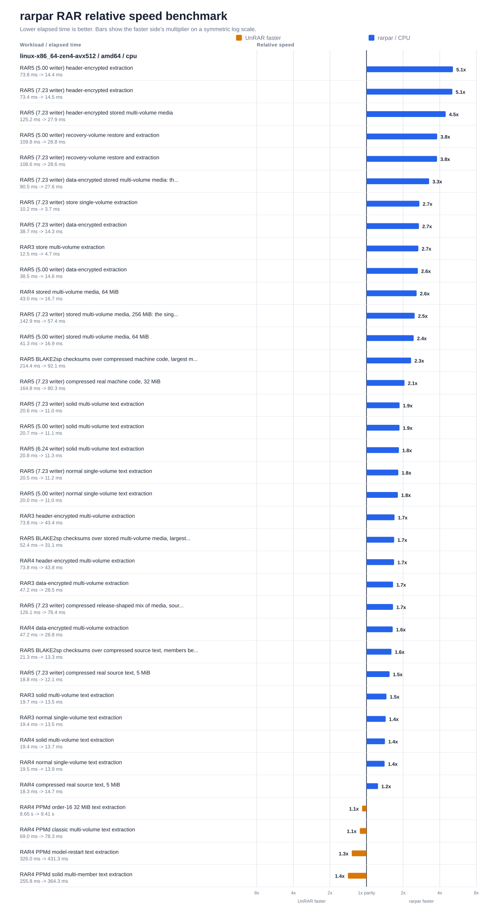](../crates/unrar-rs/docs/rarpar-rar-benchmark-linux-x86_64-zen4-avx512.svg)

[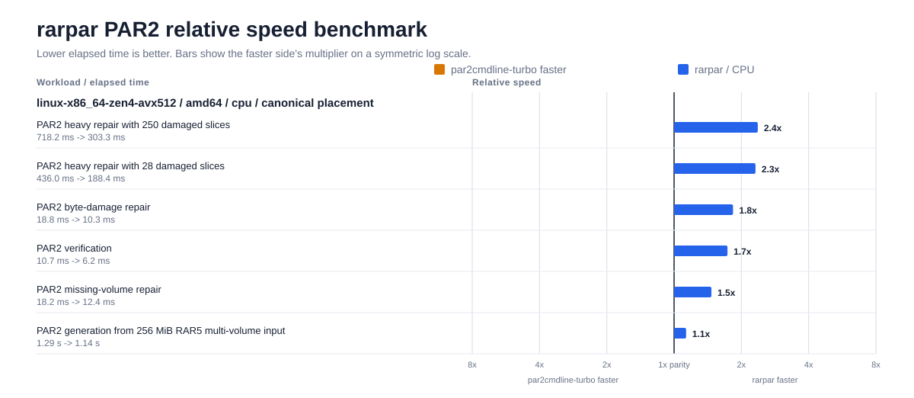](../crates/par2-rs/docs/rarpar-par2-benchmark-linux-x86_64-zen4-avx512.svg)

### Intel Xeon Platinum 8488C (Sapphire Rapids)

4 vCPU · Ubuntu 24.04, Linux 6.17 · dispatch tier GFNI + AVX-512 · candidate
`rarpar 0.3.2`, static-musl x86-64 build `67810e6e…` · references `UnRAR 7.23`
(`926d3a00…`) and `par2cmdline-turbo 1.4.0` (`9e65a4bb…`).

| Store, plain | Store, encrypted | Compressed LZ | Compressed encrypted | Compressed PPMd | PAR2 heavy |
|---:|---:|---:|---:|---:|---:|
| 1.76× | 2.62× | 1.26× | 2.02× | 0.85× | 1.88× |

This machine's store-mode classes read 4–7% below the previous publication
while its PPMd class rose, matching every other machine. The Zen 4 machine —
same dispatch tier, same candidate, same references — is flat across those same
classes, so the movement here is host-side rather than a change in `rarpar`.

[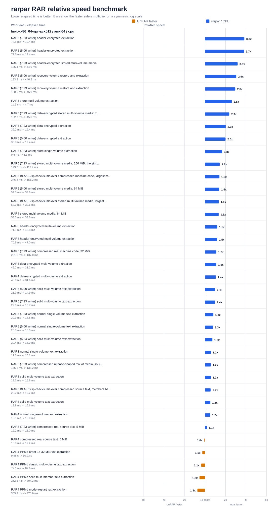](../crates/unrar-rs/docs/rarpar-rar-benchmark-linux-x86_64-spr-avx512.svg)

[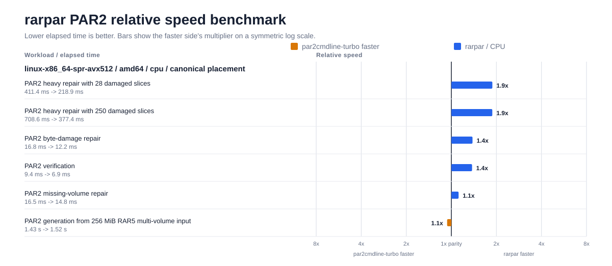](../crates/par2-rs/docs/rarpar-par2-benchmark-linux-x86_64-spr-avx512.svg)

## GFNI + AVX2

GFNI without AVX-512: the same affine-transform multiply, 256 bits wide.

### Intel Core i5-1240P (Alder Lake)

12 cores / 16 threads · Ubuntu 26.04, Linux 7.0 · dispatch tier GFNI + AVX2 ·
candidate `rarpar 0.3.2`, static-musl x86-64 build `5340a251…` · references
`UnRAR 7.23` (`926d3a00…`) and `par2cmdline-turbo 1.4.0` (`2c3ba0c5…`).

| Store, plain | Store, encrypted | Compressed LZ | Compressed encrypted | Compressed PPMd | PAR2 heavy |
|---:|---:|---:|---:|---:|---:|
| 1.47× | 2.24× | 1.14× | 1.93× | 0.86× | 2.24× |

[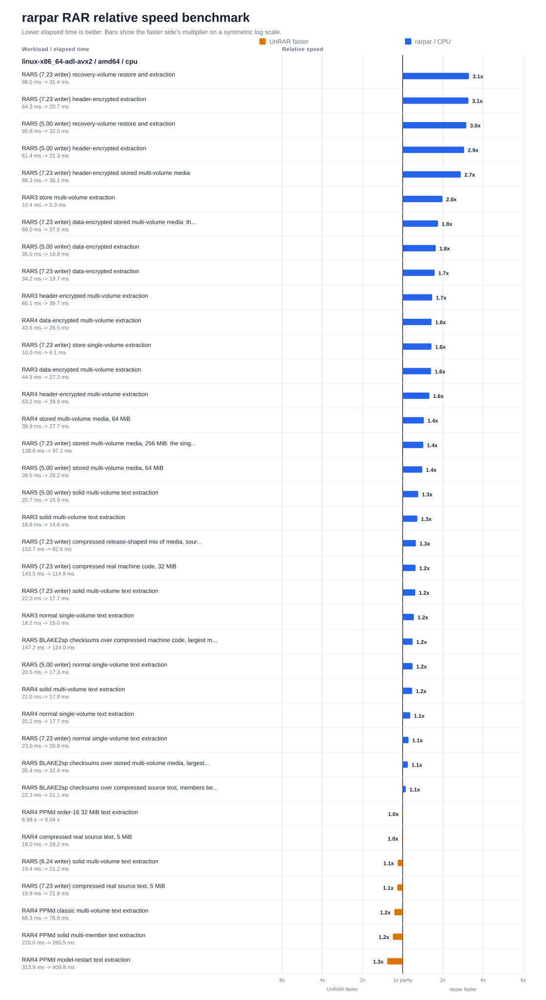](../crates/unrar-rs/docs/rarpar-rar-benchmark-linux-x86_64.svg)

[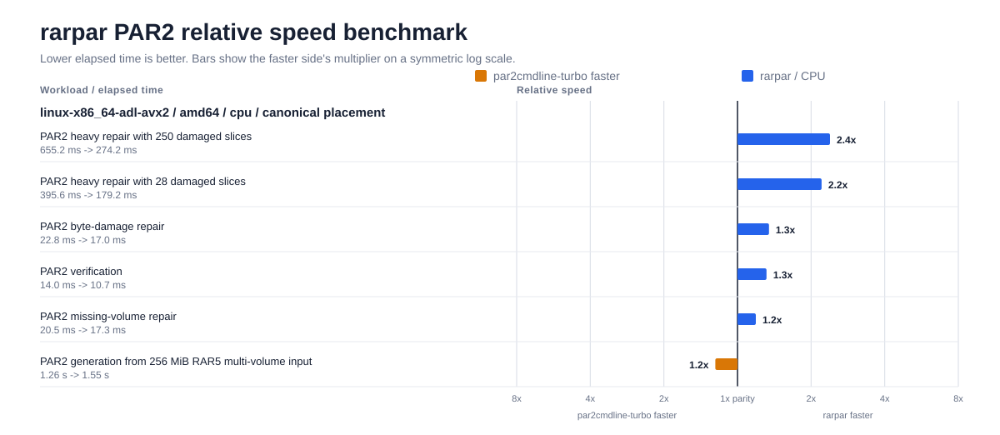](../crates/par2-rs/docs/rarpar-par2-benchmark-linux-x86_64.svg)

## AVX-512

AVX-512 without GFNI: the GF(2¹⁶) multiply uses the folded 512-bit shuffle
kernel rather than `GF2P8AFFINEQB`.

### Intel Xeon Platinum 8124M (Skylake-SP)

4 vCPU · Ubuntu 24.04, Linux 6.17 · dispatch tier AVX-512 · candidate
`rarpar 0.3.2`, static-musl x86-64 build `67810e6e…` · references `UnRAR 7.23`
(`926d3a00…`) and `par2cmdline-turbo 1.4.0` (`9e65a4bb…`).

| Store, plain | Store, encrypted | Compressed LZ | Compressed encrypted | Compressed PPMd | PAR2 heavy |
|---:|---:|---:|---:|---:|---:|
| 1.46× | 1.60× | 1.18× | 1.44× | 0.80× | 1.72× |

This is the only machine in the set that has AVX-512 without GFNI, so it is the
only one that exercises the folded 512-bit shuffle kernel and the non-GFNI
AVX-512 multiply paths. PAR2 generation moved 0.83× → 0.93× here.

[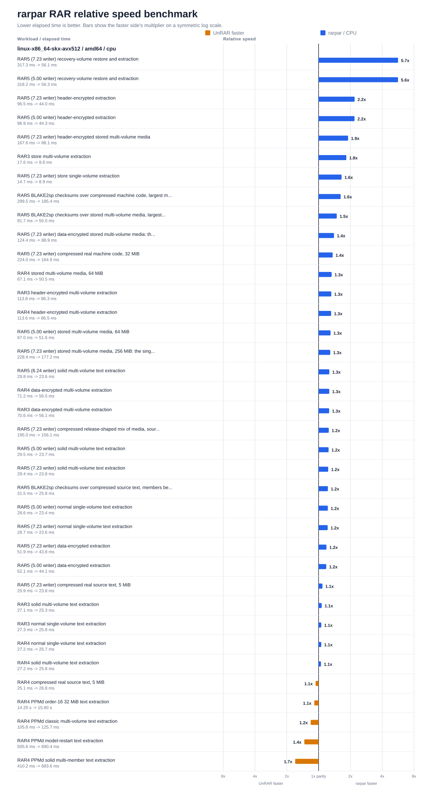](../crates/unrar-rs/docs/rarpar-rar-benchmark-linux-x86_64-skx-avx512.svg)

[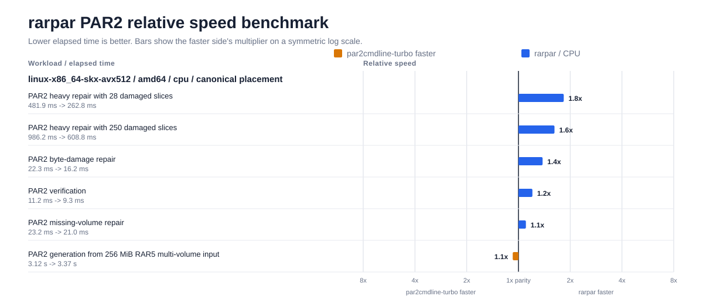](../crates/par2-rs/docs/rarpar-par2-benchmark-linux-x86_64-skx-avx512.svg)

## AVX2

No GFNI: the multiply falls back to the split-table `VPSHUFB` kernel.

### Intel Xeon E5-2666 v3 (Haswell)

4 vCPU · Ubuntu 24.04, Linux 6.17 · dispatch tier AVX2 · candidate
`rarpar 0.3.2`, static-musl x86-64 build `67810e6e…` · references `UnRAR 7.23`
(`926d3a00…`) and `par2cmdline-turbo 1.4.0` (`9e65a4bb…`).

| Store, plain | Store, encrypted | Compressed LZ | Compressed encrypted | Compressed PPMd | PAR2 heavy |
|---:|---:|---:|---:|---:|---:|
| 1.50× | 1.65× | 1.23× | 1.47× | 0.80× | 1.91× |

[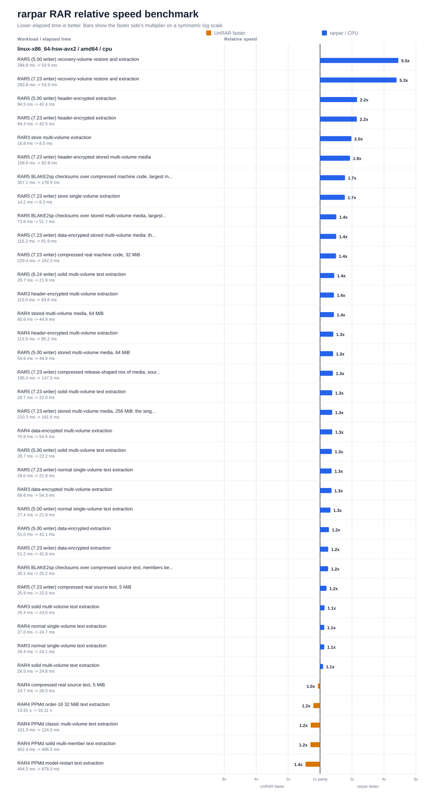](../crates/unrar-rs/docs/rarpar-rar-benchmark-linux-x86_64-hsw-avx2.svg)

[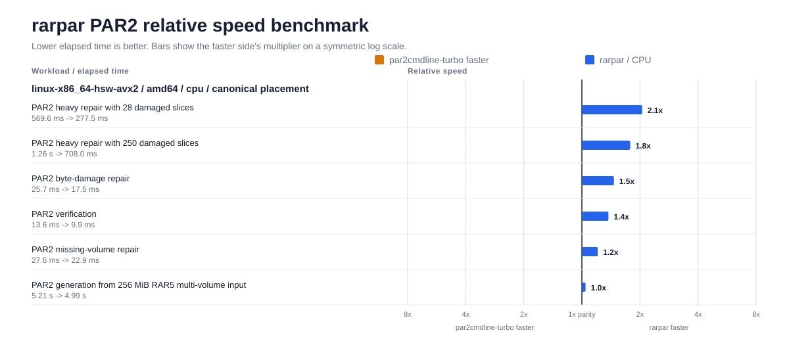](../crates/par2-rs/docs/rarpar-par2-benchmark-linux-x86_64-hsw-avx2.svg)

### AMD Ryzen 5 3600 (Zen 2)

6 cores / 12 threads · Windows 11 (10.0.22621) · dispatch tier AVX2 · candidate
`rarpar 0.3.2`, native MSVC build `96502790…` · references `UnRAR 7.23 x64`
(`0d371500…`) and `par2cmdline-turbo 1.4.0` (`43779727…`).

| Store, plain | Store, encrypted | Compressed LZ | Compressed encrypted | Compressed PPMd | PAR2 heavy |
|---:|---:|---:|---:|---:|---:|
| 1.43× | 2.09× | 1.46× | 2.22× | 0.90× | 1.56× |

This is the only Windows machine in the set. PAR2 generation is the shape that
moved most here, 0.63× → 0.92×, though it remains below parity; see the note on
the settled-state pass above. Its PPMd class gained the most of any machine
(+7.7%), and one PPMd case — solid multi-member — is now ahead of the reference
decoder at 1.02×.

[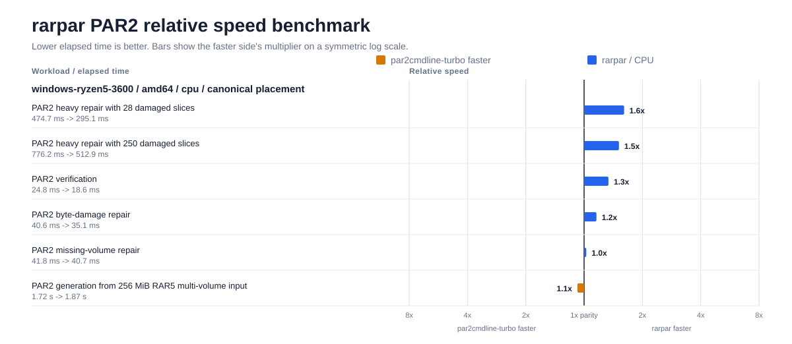](../crates/par2-rs/docs/rarpar-par2-benchmark-windows-x86_64.svg)

## SSSE3 (no AVX)

### Intel Atom C3538 (Denverton) †

4 cores · Linux 4.4 · dispatch tier SSSE3 · candidate `rarpar 0.3.1`,
static-musl x86-64 build `f796ac3b…` · references `UnRAR 7.23` (`926d3a00…`)
and `par2cmdline-turbo 1.4.0` (`2c3ba0c5…`).

| Store, plain | Store, encrypted | Compressed LZ | Compressed encrypted | Compressed PPMd | PAR2 heavy |
|---:|---:|---:|---:|---:|---:|
| 0.98× | 2.03× | 1.01× | 2.80× | 0.72× | 1.44× |

† **Carried forward, measured on commit `64f5957`.** This row and its two charts
were not re-measured for this refresh, so they do not include this candidate's
PPMd or PAR2 generation work; every other x86-64 row on this page moved on both.
The corpus, plans and reference binaries are the same ones used above, so the
comparison itself is still like-for-like.

Plain store-mode and plain compressed extraction sit at parity on this tier —
the one rung where `rarpar`'s wider kernels have nothing to work with. The
encrypted classes still win by a wide margin, because AES runs through AWS-LC
against the reference's own AES path.

[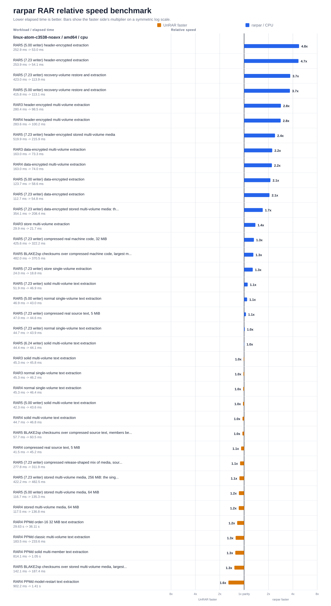](../crates/unrar-rs/docs/rarpar-rar-benchmark-linux-x86_64-noavx.svg)

[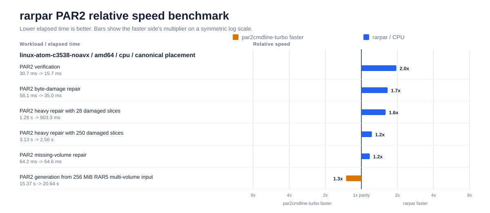](../crates/par2-rs/docs/rarpar-par2-benchmark-linux-x86_64-noavx.svg)

---

# arm64

AArch64 builds use the NEON kernel family; the PMULL carry-less multiply path
and the EOR3 three-way XOR are picked up at runtime where the CPU exposes them.
There is no separate SVE tier.

## Apple M5 Max (macOS) †

18 cores · macOS, Darwin 25.5 · dispatch tier NEON · candidates `rarpar 0.3.1`,
native arm64 builds `ee8723cb…` (CPU lane) and `ea802b2c…` (Metal lane) ·
references `UnRAR 7.23` (`99720d63…`) and `par2cmdline-turbo 1.4.0`
(`32ab46c2…`).

| Store, plain | Store, encrypted | Compressed LZ | Compressed encrypted | Compressed PPMd | PAR2 heavy (CPU) | PAR2 heavy (Metal) |
|---:|---:|---:|---:|---:|---:|---:|
| 1.07× | 2.63× | 1.21× | 2.41× | 0.98× | 7.20× | 5.76× |

† **Carried forward, measured on commit `64f5957`.** Neither lane was
re-measured for this refresh, so these figures — and the Metal-versus-CPU
timings below — predate this candidate's PPMd and PAR2 generation work. The
three Apple-silicon charts are unchanged from the previous refresh. On the
machines that were re-measured, PPMd rose 3–8% as a class and Arm PAR2
generation crossed parity, so this row is likely to be conservative on both.

[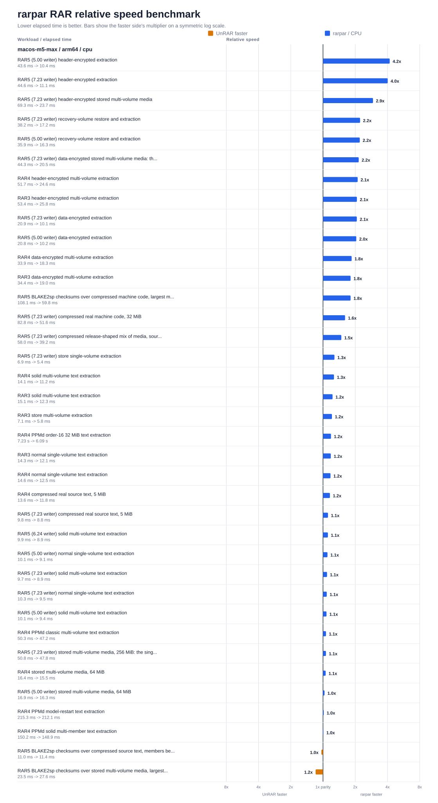](../crates/unrar-rs/docs/rarpar-rar-benchmark-macos-arm64.svg)

The PAR2 column is the one to read with the macOS caveat above in mind: the
macOS reference binary is slow, and it lifts all six PAR2 cases here.

### Metal lane

Shipped `rarpar` binaries are CPU-only. The chart below measures the PAR2
library's optional `metal` feature under normal runtime gating — no force
override. Only the two heavy-repair cases qualified and ran on the GPU;
verification, byte-damage, missing-volume, and generation stayed on CPU in
this lane too.

[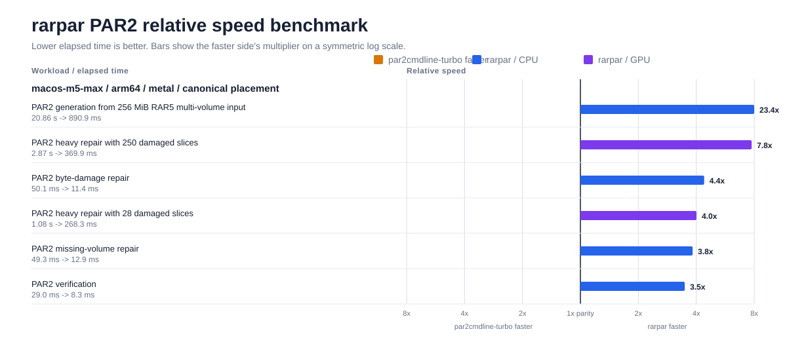](../crates/par2-rs/docs/rarpar-par2-benchmark-macos-arm64-metal.svg)

On this corpus Metal was slightly *slower* in wall time than the NEON path
(`par2-heavy-damage-250`: 305 ms on Metal against 250 ms on CPU) while using
about a third of the CPU time. The GPU lane's value here is freed CPU, not
lower latency; these repairs are small enough that the NEON kernels already
saturate the useful parallelism. These timings carry forward with the rest of
the Apple-silicon row and were last measured on `64f5957`.

## Arm Cortex-A72

4 vCPU · Ubuntu 24.04, Linux 6.17 · dispatch tier NEON · candidate
`rarpar 0.3.2`, static-musl arm64 build `2db548cf…` · references
`UnRAR 7.23` (source build) (`34175fab…`) and `par2cmdline-turbo 1.4.0`
(`df2884ca…`).

| Store, plain | Store, encrypted | Compressed LZ | Compressed encrypted | Compressed PPMd | PAR2 heavy |
|---:|---:|---:|---:|---:|---:|
| 1.74× | 6.48× | 1.35× | 2.80× | 1.02× | 1.23× |

PAR2 generation moved further on this core than on any other machine in the
set, 0.54× → 1.14×.

[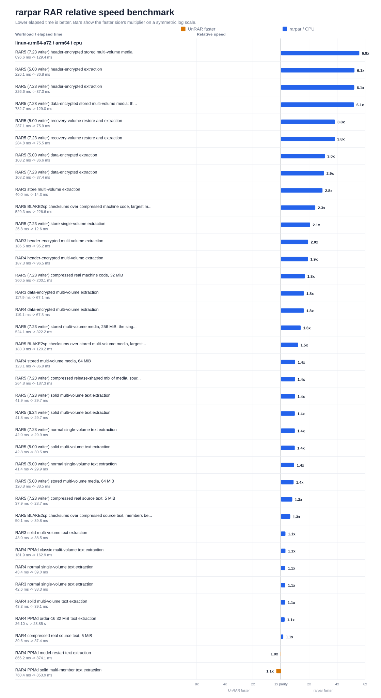](../crates/unrar-rs/docs/rarpar-rar-benchmark-linux-arm64-a72.svg)

[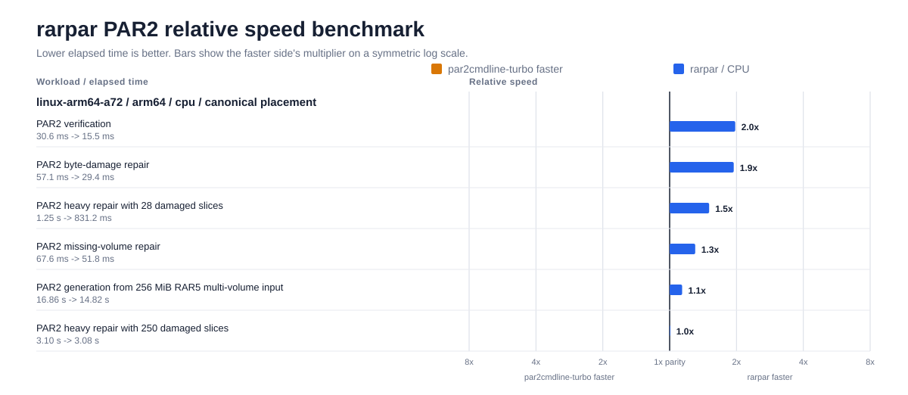](../crates/par2-rs/docs/rarpar-par2-benchmark-linux-arm64-a72.svg)

## Arm Neoverse N1

4 vCPU · Ubuntu 24.04, Linux 6.17 · dispatch tier NEON · candidate
`rarpar 0.3.2`, static-musl arm64 build `2db548cf…` · references
`UnRAR 7.23` (source build) (`34175fab…`) and `par2cmdline-turbo 1.4.0`
(`df2884ca…`).

| Store, plain | Store, encrypted | Compressed LZ | Compressed encrypted | Compressed PPMd | PAR2 heavy |
|---:|---:|---:|---:|---:|---:|
| 2.21× | 8.88× | 1.38× | 3.15× | 1.03× | 1.53× |

PAR2 generation crossed parity here, 0.74× → 1.12×.

[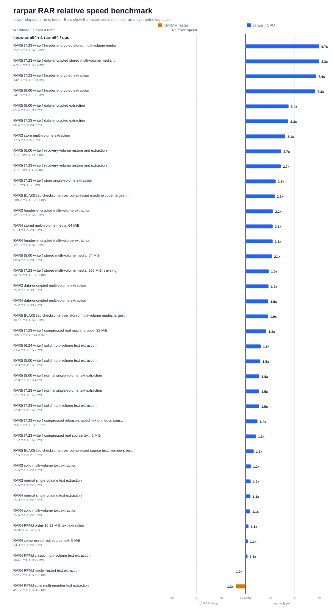](../crates/unrar-rs/docs/rarpar-rar-benchmark-linux-arm64-n1.svg)

## Arm Neoverse V2

4 vCPU · Ubuntu 24.04, Linux 6.17 · dispatch tier NEON · candidate
`rarpar 0.3.2`, static-musl arm64 build `2db548cf…` · references
`UnRAR 7.23` (source build) (`34175fab…`) and `par2cmdline-turbo 1.4.0`
(`df2884ca…`).

| Store, plain | Store, encrypted | Compressed LZ | Compressed encrypted | Compressed PPMd | PAR2 heavy |
|---:|---:|---:|---:|---:|---:|
| 2.58× | 12.50× | 1.50× | 3.23× | 1.08× | 1.56× |

The widest encrypted store-mode figure on the board, and PAR2 generation
crossed parity here too, 0.77× → 1.06×.

[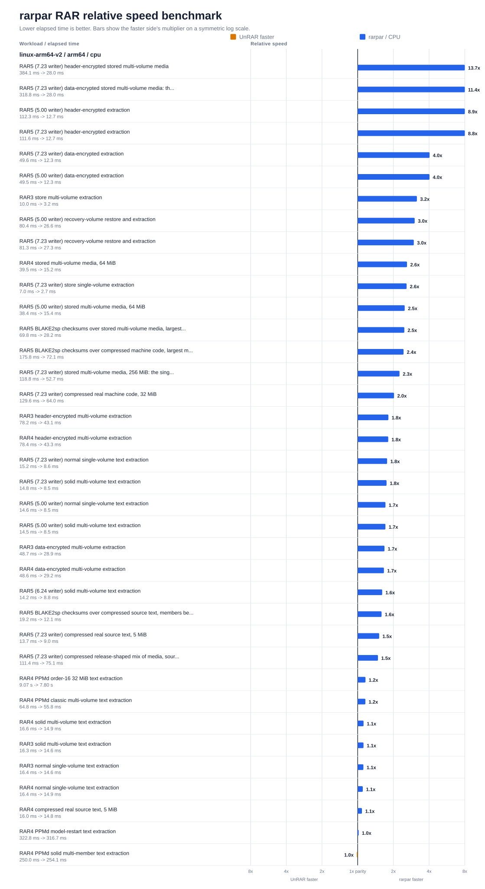](../crates/unrar-rs/docs/rarpar-rar-benchmark-linux-arm64-v2.svg)

[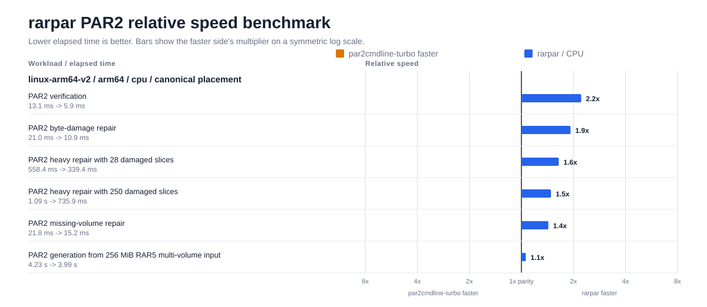](../crates/par2-rs/docs/rarpar-par2-benchmark-linux-arm64-v2.svg)

