# rarpar benchmarks

This is the full benchmark record behind the summary table in the
[README](../README.md). Every chart on this page comes from one 43-case
`rarpar-bench` corpus, one pair of measurement plans, and the same reference
tools, so charts can be read across machines.

Charts are grouped by **architecture**, then by **dispatch tier** — the SIMD
kernel family `rarpar` actually selects at runtime on that silicon. Both the
RAR family chart and the PAR2 family chart are shown for every machine. Click
any chart to open it full size.

## Methodology

**What is measured.** Each case is a whole-CLI run: discovery, the operation
itself, integrity checking, and output handling. These are release-workflow
measurements, not isolated decoder or kernel microbenchmarks. Every produced
byte is validated against expected paths, sizes, and SHA-256 values, and
unmatched or failed samples are dropped rather than reported. The figure taken
from each case is the **median wall-clock time** over the measured repeats.

**How ratios are formed.** Every number on this page is
`reference median wall time / rarpar median wall time`. **Above 1 means
`rarpar` is faster**, and `2.0×` means `rarpar` finished in half the time.
The charts plot that ratio per case. The tables aggregate it into a
**geometric mean** over a workload class — geometric rather than arithmetic so
that a 4× win and a 0.25× loss cancel to parity instead of averaging to 2.1×.

**Protocol.** One warmup and seven measured repeats per case, in a
deterministic plan order, with the candidate and the reference alternating
which one runs first so that ordering cannot bias a pair. Each sample runs in
its own byte-copied private staging directory. Runs are gated on a quiet
machine — an idle-CPU sample must clear its threshold before a timed window
opens, and the candidate and the reference for a given case are measured
inside the same window. The corpus is the 43-case real-payload
`rarpar-bench` corpus, digest `59f46fa58f65…`, byte-verified on every machine
before measurement; it contains real media, real source text, and real machine
code alongside the synthetic format-coverage cases. The PAR2 plan uses
`canonical` placement — the comparable lane for conventional PAR2 tools, with
`rarpar`'s content-based relocation scan switched off.

**What was built.** The Linux rows on this page — x86-64 and arm64 alike —
measure the portable **static-musl** artifact: the same binary shipped in the
Linux musl release archives and used to build the container image. The macOS
and Windows rows measure **native** builds for those platforms. A native glibc
Linux build measures a few percent faster than the musl artifact on the same
hardware, so the Linux rows are, if anything, conservative.

**Standing caveats.**

- *macOS PAR2.* The macOS rows are measured against upstream's published
  `macos-arm64` `par2cmdline-turbo` binary — the same reference role as every
  other row, taken from the project's own release. That binary is markedly
  slower on macOS than the Linux and Windows builds of the same version, which
  lifts every macOS PAR2 ratio here, including the 7.2× heavy-repair figure.
  It is an honest comparison against what a macOS user would actually install;
  it is not a claim that the PAR2 engine is five times faster on Apple Silicon
  than on x86-64.
- *arm64 RAR reference.* RARLAB publishes no Linux/arm64 UnRAR binary, so the
  three Linux/arm64 machines run a source build of the same `7.23` release
  (the source archive self-identifies as `7.20 beta 3` — RARLAB's naming for
  the identical build). Same version, same comparison as every other row.
- *Windows CPU time.* The Windows machine's CPU-time counter is quantized to
  roughly 15.6 ms, so short cases report zero CPU seconds there. Every figure
  on this page is wall-clock and is unaffected.
- *Shapes that lose.* RAR4 PPMd trails the reference decoder on every x86-64
  machine (0.72×–0.84× as a class) and is counted in the compressed-extraction
  class anyway; on the Arm cores it has reached roughly parity (0.95×–1.02×).
  PAR2 generation still trails `par2cmdline-turbo` on most machines, because
  `rarpar` flushes and re-validates every written recovery volume before
  commit; it is now ahead on Zen 4 (1.13×) and Haswell (1.05×). It is charted
  per machine but is not part of the heavy-repair class.

### Workload classes

| Class | Meaning | Cases |
|---|---|---:|
| **unrar (binary)** | Store-mode extraction — uncompressible payloads (media), including the encrypted and BLAKE2sp variants | 8 |
| **unrar (text)** | Compressed extraction — the LZ and PPMd decode paths, including compressed machine code, mixed release payloads, and the encrypted compressed cases | 27 |
| **par2 (heavy)** | `par2-heavy-damage-28` + `par2-heavy-damage-250` | 2 |

`unrar (text)` **includes PPMd.** PPMd is an archaic RAR4 mode that is
deliberately left unoptimized, and it drags the compressed-extraction geomean
down on every x86-64 machine (it now sits at roughly parity on the Arm
cores); it is counted regardless.

Six of the 43 cases sit outside these three classes. They are charted but not
aggregated: `rar5-v5-recovery-volume` and `rar5-v7-recovery-volume` (recovery
volume reconstruction rather than an extraction shape), and the four non-heavy
PAR2 cases `par2-verify`, `par2-byte-damage`, `par2-missing-volume`, and
`par2-generate-rar5-v7-volumes`.

### Versions tested in this publication

This page always reflects the most recent benchmark run — it is not a running
ledger; historical results live in this file's git history. This block records
exactly what produced the current numbers and is replaced wholesale by each
refresh.

| Component | Version |
|---|---|
| `rarpar` CLI | 0.3.1, workspace commit `64f5957` |
| `par2-rs` | 0.4.1 |
| `unrar-rs` | 0.5.1 |
| Rust toolchain | 1.97.1 |
| Corpus | `rarpar-bench`, 43 cases, digest `59f46fa58f65…` |
| RAR plan / PAR2 plan | `plan-e4222071b3f06c00` / `plan-900b3c52bca9463e` (Metal lane `plan-e9c4aa7366c941c8`) |

Reference tools, with the binary identity recorded by each run:

| Reference | Platform | SHA-256 |
|---|---|---|
| `UnRAR 7.23` | Linux x86-64 | `926d3a00…` |
| `UnRAR 7.23 x64` | Windows | `0d371500…` |
| `UnRAR 7.23` | macOS arm64 | `99720d63…` |
| `UnRAR 7.23` (source build; self-identifies as `7.20 beta 3`) | Linux arm64 | `34175fab…` |
| `par2cmdline-turbo 1.4.0` | Linux x86-64 | `9e65a4bb…`, `2c3ba0c5…` |
| `par2cmdline-turbo 1.4.0` | Linux arm64 | `df2884ca…` |
| `par2cmdline-turbo 1.4.0` | Windows | `43779727…` |
| `par2cmdline-turbo 1.4.0` | macOS arm64 | `32ab46c2…` |

The two Linux x86-64 `par2cmdline-turbo` digests are the same released
version provisioned by two paths; both are recorded rather than merged.

The harness, corpus generation, plan creation, and chart rendering are
documented in [benchmarking.md](benchmarking.md).

## Summary

Geometric mean per class, one decimal. Per-class breakouts follow each machine.

| CPU | Arch | Dispatch tier | unrar (binary) | unrar (text) | par2 (heavy) |
|---|---|---|---:|---:|---:|
| AMD EPYC 9R14 (Zen 4) | x86-64 | GFNI + AVX-512 | 2.7× | 1.7× | 2.3× |
| Intel Xeon Platinum 8488C (Sapphire Rapids) | x86-64 | GFNI + AVX-512 | 2.1× | 1.4× | 1.9× |
| Intel Core i5-1240P (Alder Lake) | x86-64 | GFNI + AVX2 | 1.7× | 1.3× | 2.3× |
| Intel Xeon Platinum 8124M (Skylake-SP) | x86-64 | AVX-512 | 1.5× | 1.2× | 1.8× |
| AMD Ryzen 5 3600 (Zen 2) | x86-64 | AVX2 | 1.6× | 1.5× | 1.6× |
| Intel Xeon E5-2666 v3 (Haswell) | x86-64 | AVX2 | 1.5× | 1.2× | 1.9× |
| Intel Atom C3538 (Denverton) | x86-64 | SSSE3 (no AVX) | 1.2× | 1.3× | 1.4× |
| Apple M5 Max | arm64 | NEON | 1.3× | 1.4× | 7.2× |
| Arm Cortex-A72 | arm64 | NEON | 2.3× | 1.6× | 1.2× |
| Arm Neoverse N1 | arm64 | NEON | 3.1× | 1.7× | 1.5× |
| Arm Neoverse V2 | arm64 | NEON | 3.8× | 1.8× | 1.5× |

---

# x86-64

`rarpar` detects x86-64 instruction support at runtime and takes the first
available kernel from `GFNI + AVX-512` → `GFNI + AVX2` → `AVX-512` → `AVX2` →
`SSSE3`. The machines below cover four of those five rungs.

## GFNI + AVX-512

The top rung: GF(2¹⁶) multiply-accumulate runs on `GF2P8AFFINEQB` over 512-bit
vectors.

### AMD EPYC 9R14 (Zen 4)

4 vCPU · Ubuntu 24.04, Linux 6.17 · dispatch tier GFNI + AVX-512 · candidate
`rarpar 0.3.1`, static-musl x86-64 build `7f53547d…` · references `UnRAR 7.23`
(`926d3a00…`) and `par2cmdline-turbo 1.4.0` (`9e65a4bb…`).

| Store, plain | Store, encrypted | Compressed LZ | Compressed encrypted | Compressed PPMd | PAR2 heavy |
|---:|---:|---:|---:|---:|---:|
| 2.40× | 3.83× | 1.67× | 2.48× | 0.81× | 2.34× |

### Intel Xeon Platinum 8488C (Sapphire Rapids)

4 vCPU · Ubuntu 24.04, Linux 6.17 · dispatch tier GFNI + AVX-512 · candidate
`rarpar 0.3.1`, static-musl x86-64 build `7f53547d…` · references `UnRAR 7.23`
(`926d3a00…`) and `par2cmdline-turbo 1.4.0` (`9e65a4bb…`).

| Store, plain | Store, encrypted | Compressed LZ | Compressed encrypted | Compressed PPMd | PAR2 heavy |
|---:|---:|---:|---:|---:|---:|
| 1.85× | 2.81× | 1.29× | 2.07× | 0.80× | 1.91× |

[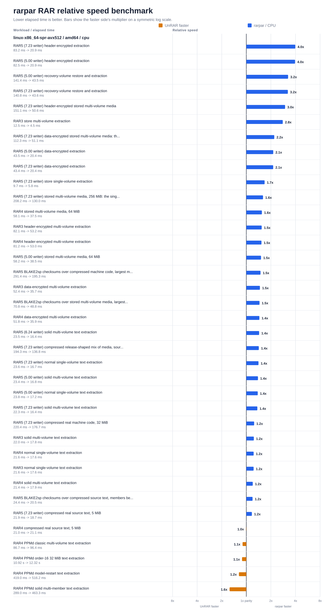](../crates/weaver-unrar/docs/rarpar-rar-benchmark-linux-x86_64-spr-avx512.svg)

## GFNI + AVX2

GFNI without AVX-512: the same affine-transform multiply, 256 bits wide.

### Intel Core i5-1240P (Alder Lake)

12 cores / 16 threads · Ubuntu 26.04, Linux 7.0 · dispatch tier GFNI + AVX2 ·
candidate `rarpar 0.3.1`, static-musl x86-64 build `f796ac3b…` · references
`UnRAR 7.23` (`926d3a00…`) and `par2cmdline-turbo 1.4.0` (`2c3ba0c5…`).

| Store, plain | Store, encrypted | Compressed LZ | Compressed encrypted | Compressed PPMd | PAR2 heavy |
|---:|---:|---:|---:|---:|---:|
| 1.50× | 2.27× | 1.14× | 1.98× | 0.83× | 2.30× |

[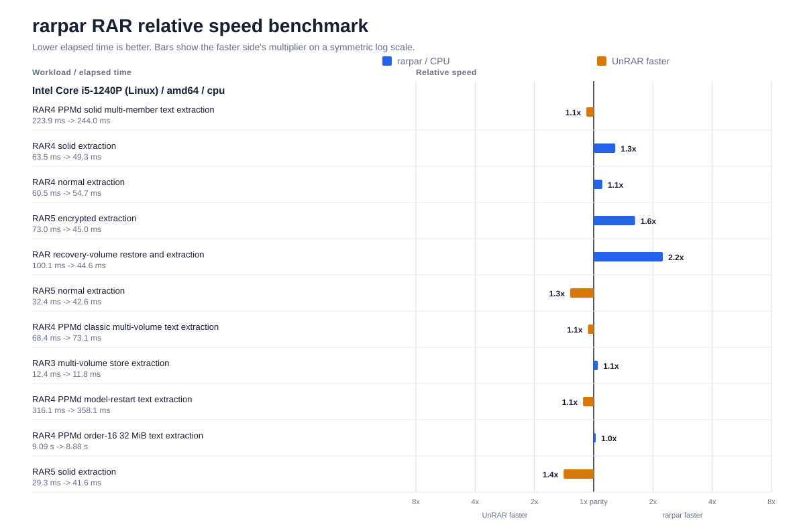](../crates/weaver-unrar/docs/rarpar-rar-benchmark-linux-x86_64.svg)

[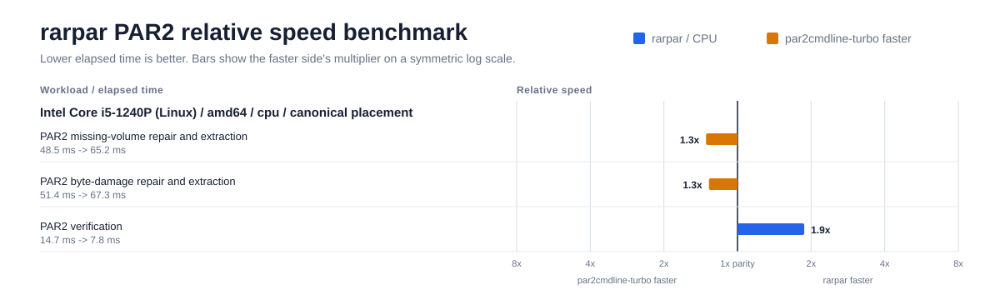](../crates/weaver-par2/docs/rarpar-par2-benchmark-linux-x86_64.svg)

## AVX-512

AVX-512 without GFNI: the GF(2¹⁶) multiply uses the folded 512-bit shuffle
kernel rather than `GF2P8AFFINEQB`.

### Intel Xeon Platinum 8124M (Skylake-SP)

[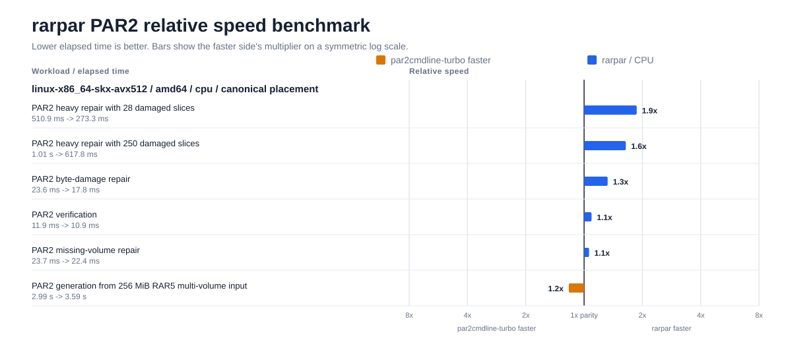](../crates/weaver-par2/docs/rarpar-par2-benchmark-linux-x86_64-skx-avx512.svg)

## AVX2

No GFNI: the multiply falls back to the split-table `VPSHUFB` kernel.

### Intel Xeon E5-2666 v3 (Haswell)

[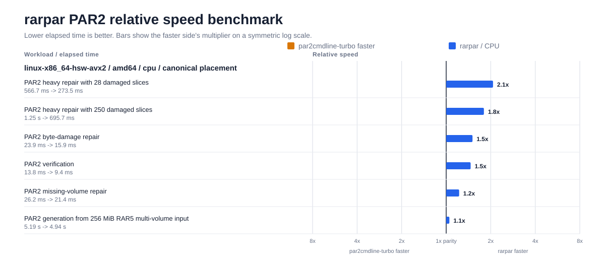](../crates/weaver-par2/docs/rarpar-par2-benchmark-linux-x86_64-hsw-avx2.svg)

### AMD Ryzen 5 3600 (Zen 2)

[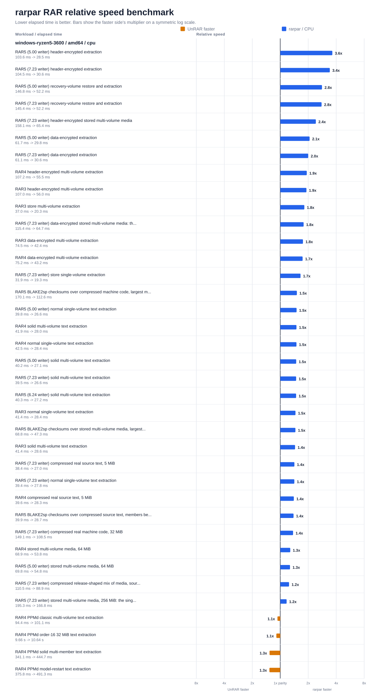](../crates/weaver-unrar/docs/rarpar-rar-benchmark-windows-x86_64.svg)

[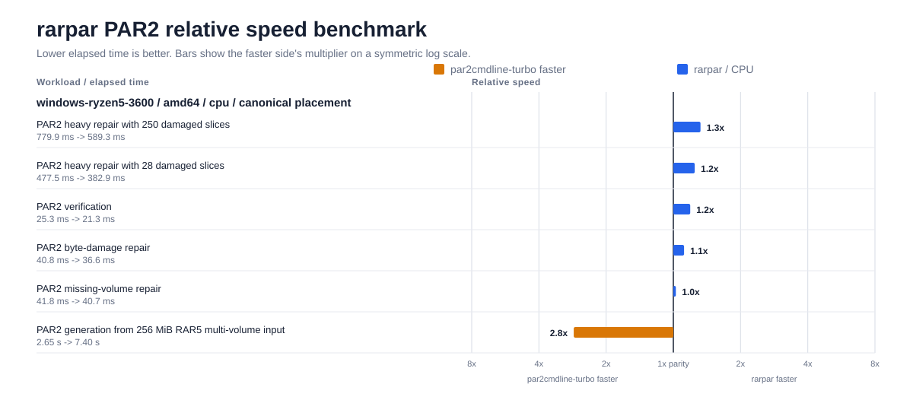](../crates/weaver-par2/docs/rarpar-par2-benchmark-windows-x86_64.svg)

## SSSE3 (no AVX)

### Intel Atom C3538 (Denverton)

[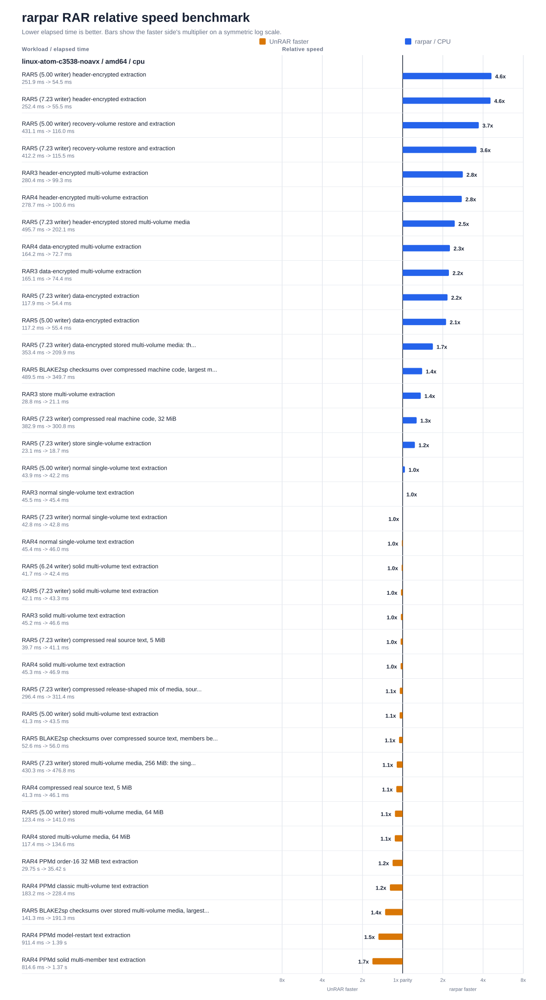](../crates/weaver-unrar/docs/rarpar-rar-benchmark-linux-x86_64-noavx.svg)

[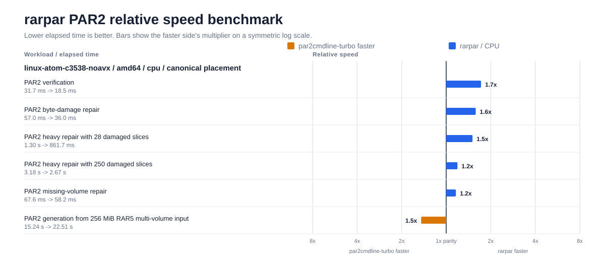](../crates/weaver-par2/docs/rarpar-par2-benchmark-linux-x86_64-noavx.svg)

---

# arm64

## Apple M5 Max (macOS)

[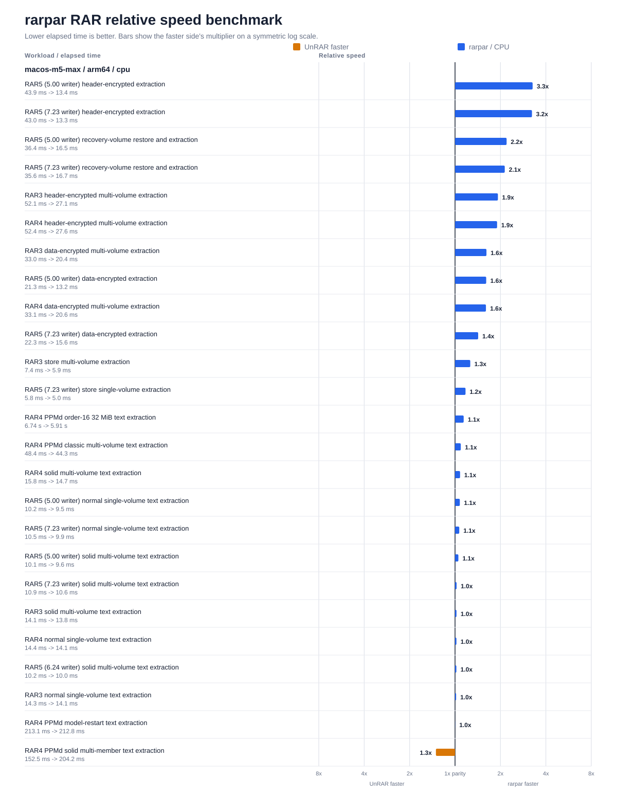](../crates/weaver-unrar/docs/rarpar-rar-benchmark-macos-arm64.svg)

[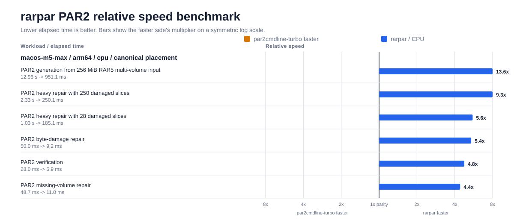](../crates/weaver-par2/docs/rarpar-par2-benchmark-macos-arm64-cpu.svg)

The PAR2 column is the one to read with the macOS caveat above in mind: the
macOS reference binary is slow, and it lifts all six PAR2 cases here.

### Metal lane

Shipped `rarpar` binaries are CPU-only. The chart below measures the PAR2
library's optional `metal` feature under normal runtime gating — no force
override. Only the two heavy-repair cases qualified and ran on the GPU;
verification, byte-damage, missing-volume, and generation stayed on CPU in
this lane too.

[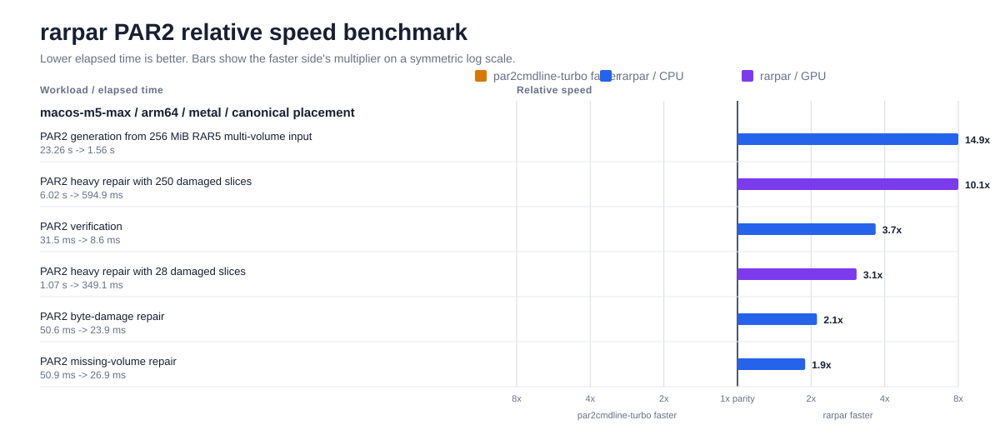](../crates/weaver-par2/docs/rarpar-par2-benchmark-macos-arm64-metal.svg)

On this corpus Metal is slightly *slower* in wall time than the NEON path
(`par2-heavy-damage-250`: 286 ms on Metal against 262 ms on CPU) while using
about a third of the CPU time (322 ms against 1,077 ms). The GPU lane's value
here is freed CPU, not lower latency; these repairs are small enough that the
NEON kernels already saturate the useful parallelism.

## Arm Cortex-A72

[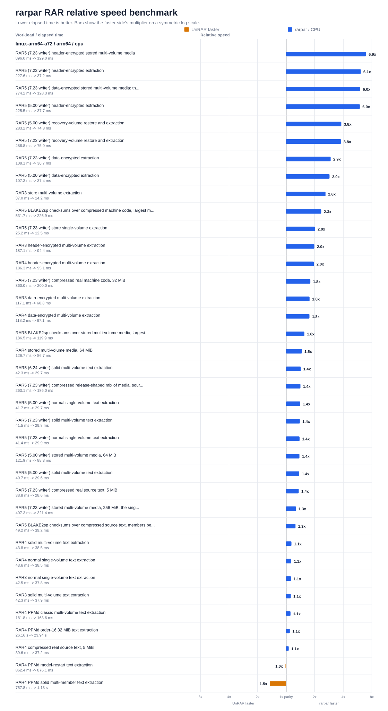](../crates/weaver-unrar/docs/rarpar-rar-benchmark-linux-arm64-a72.svg)

[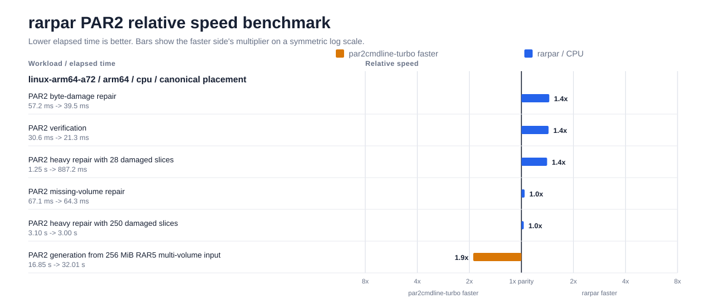](../crates/weaver-par2/docs/rarpar-par2-benchmark-linux-arm64-a72.svg)

## Arm Neoverse N1

[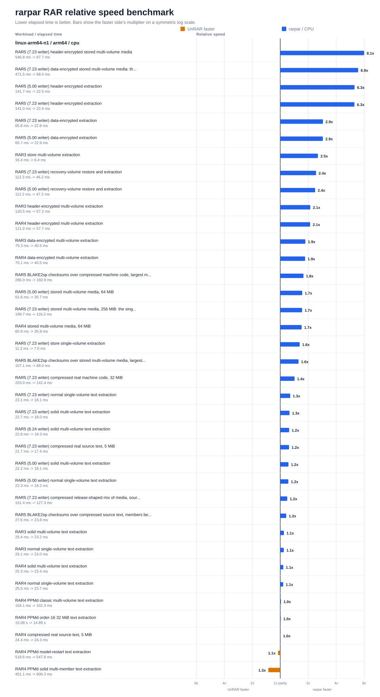](../crates/weaver-unrar/docs/rarpar-rar-benchmark-linux-arm64-n1.svg)

[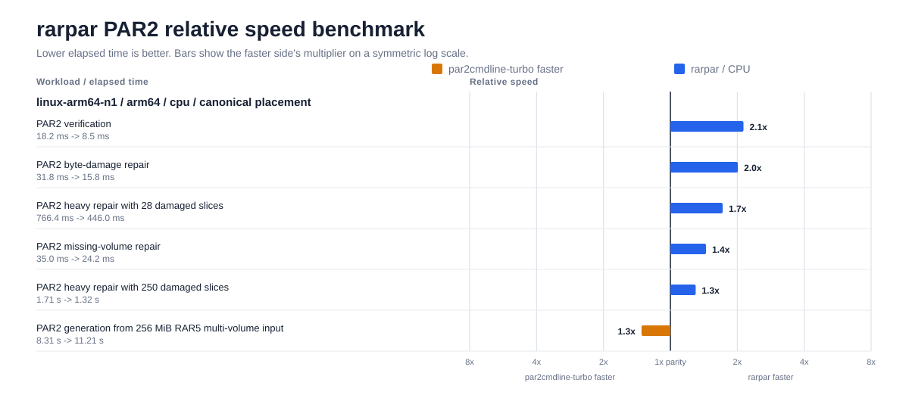](../crates/weaver-par2/docs/rarpar-par2-benchmark-linux-arm64-n1.svg)

## Arm Neoverse V2

[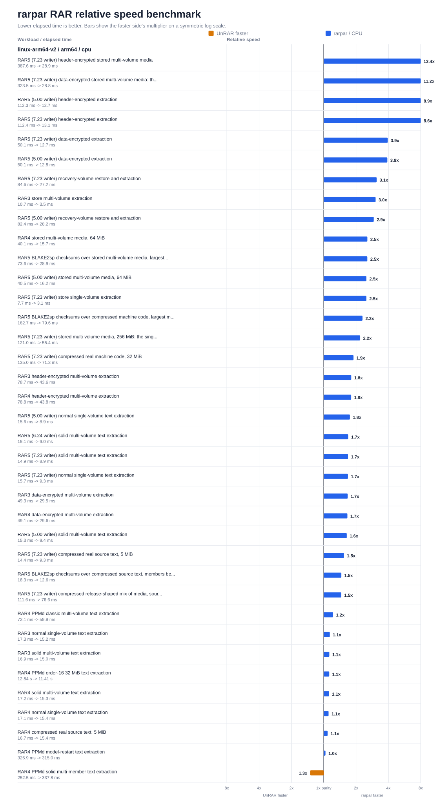](../crates/weaver-unrar/docs/rarpar-rar-benchmark-linux-arm64-v2.svg)

